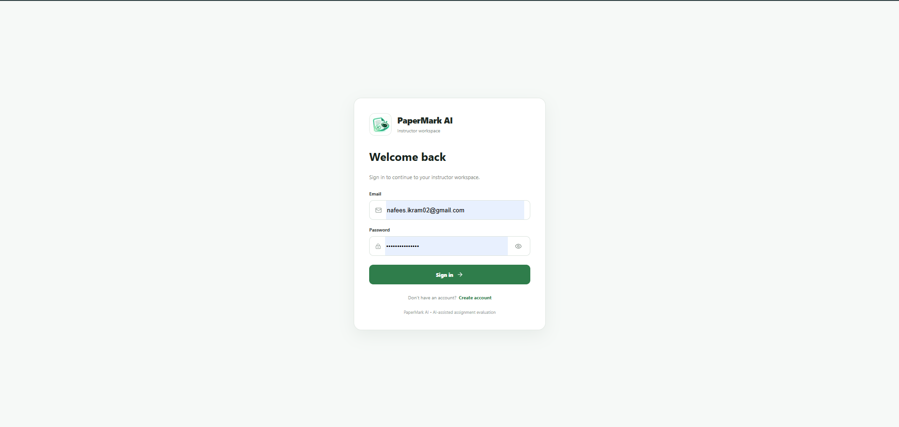
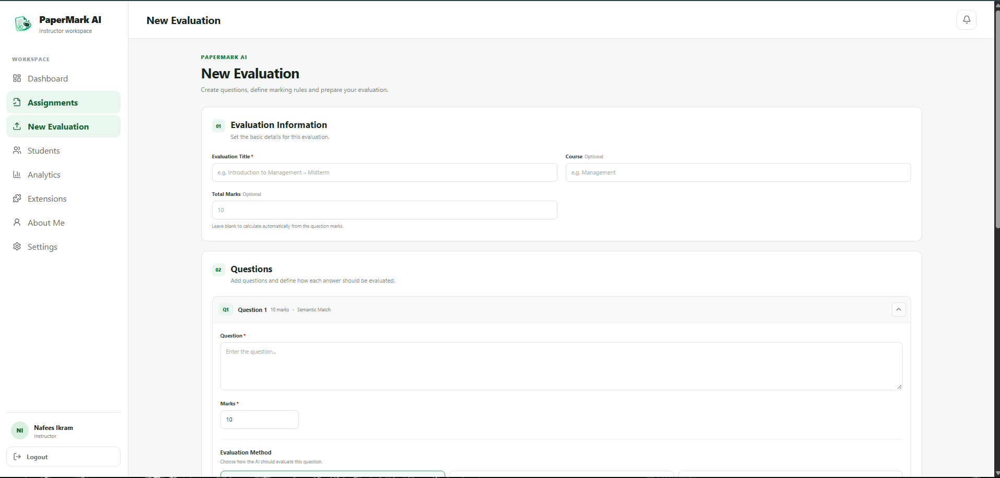
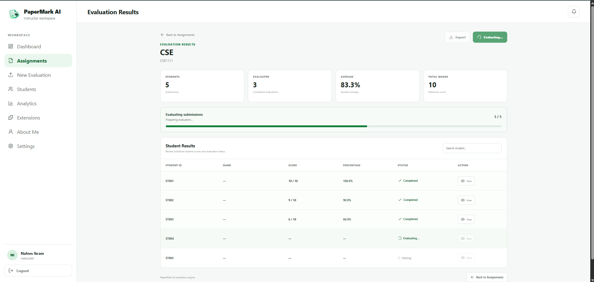
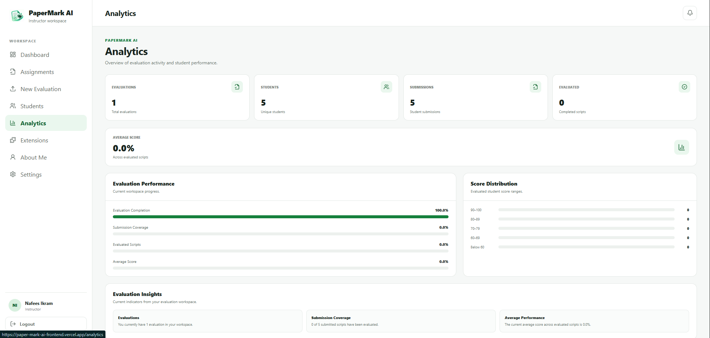
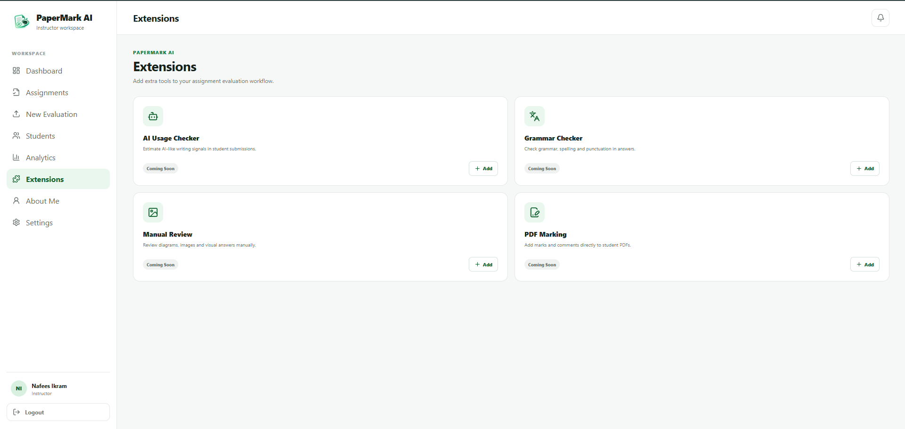

<div align="left">
  

  <h1>
    PaperMark AI
    
    
    
  </h1>
</div>

<br clear="left">

PaperMark AI is an AI assisted assignment evaluation platform designed to help instructors evaluate student answers more efficiently, consistently, and transparently. It addresses a common academic concern where students may question whether their marks accurately reflect the quality of their answers compared with other students’ answers, while instructors may need an additional reference when responding to grading concerns or reviewing.

Instructors can choose between fully AI powered evaluation or use AI as a second opinion alongside their own grading. They can define questions, expected answers, marks, and custom rubrics based on criteria such as semantic meaning, conceptual accuracy, completeness, and relevance. PaperMark AI then generates scores, detailed feedback, and question level evaluations. Instructors can also compare the AI evaluation with their own assessment before making the final grading decision.

The project is currently in the MVP and Beta stage, with additional grading comparison, evaluation consistency analysis, and document processing features planned for future versions.

## Live Demo

Frontend:  
https://paper-mark-ai-frontend.vercel.app/

Backend API:  
https://papermark-ai-backend.onrender.com/

## Screenshots

### Login



### New Evaluation



### Evaluation Result



### Analytics



### Extensions



## About the Project

PaperMark AI allows an instructor to create an evaluation by providing questions and expected answers. Student answers can then be evaluated using AI assisted analysis.

The system generates a score and evaluation feedback based on the student's answer. It also provides an overview of student results and evaluation statistics.

The main purpose of the project is to make the initial assignment evaluation process faster while keeping the instructor involved in the final review.

## Current Features

- Instructor registration and login
- Instructor dashboard
- Assignment management
- New evaluation creation
- Question and expected answer setup
- Student submission management
- AI-assisted answer evaluation
- Student scoring and percentage calculation
- Evaluation feedback
- Individual student result view
- Evaluation analytics
- Student management
- Evaluation status tracking

## Technology

### Frontend

- Next.js
- React
- TypeScript
- CSS Modules
- Lucide React

### Backend

- Python
- FastAPI
- SQLAlchemy
- PostgreSQL
- Supabase
- Groq API
- JWT authentication

### Deployment

- Vercel for the frontend
- Render for the backend
- Supabase for PostgreSQL
- GitHub for source control

## Project Structure

The project is divided into two repositories.

### Frontend

Repository:

https://github.com/NafeesIkram/PaperMark-AI-Frontend

The frontend is responsible for the user interface, instructor dashboard, evaluation setup, student management, results, analytics, and communication with the backend API.

### Backend

Repository:

https://github.com/NafeesIkram/PaperMark-AI-Backend

The backend handles authentication, database operations, AI evaluation requests, student data, and evaluation results.

## Running the Frontend Locally

### 1. Clone the repository

```bash
git clone https://github.com/NafeesIkram/PaperMark-AI-Frontend.git
```

### 2. Open the project

```bash
cd PaperMark-AI-Frontend
```

### 3. Install dependencies

```bash
npm install
```

### 4. Create a .env.local file

```bash
NEXT_PUBLIC_API_URL=http://localhost:8000
```

### 5. Start the development server

```bash
http://localhost:3000
```

### Future Development

- PDF assignment upload
- PDF text extraction
- OCR for scanned assignments
- Support for handwritten submissions
- Code and programming question evaluation
- AI-assisted plagiarism checking
- More detailed evaluation comments
- Descriptive evaluation reports
- Automated report generation
- PDF annotation and marking
- Advanced rubric-based evaluation
- Grammar and writing analysis
- Advanced student performance analytics
- Evaluation history
- More AI model and provider options
- Instructor review and manual adjustment of AI-generated results

### Development Status

The current version is an MVP. The core evaluation workflow is already implemented, while additional document processing and advanced evaluation features are being developed incrementally.

### Developer

Nafees Ikram

Developer interested in software development, AI applications, web development, automation, and technology projects.

### Note

PaperMark AI is a personal development project and is currently being developed and improved through continuous testing and iteration.
